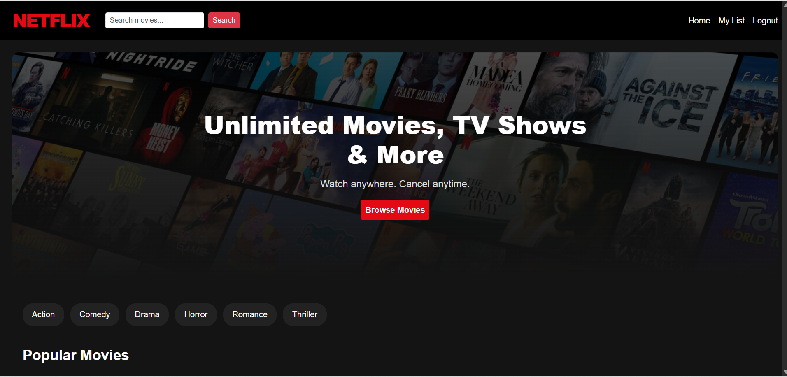
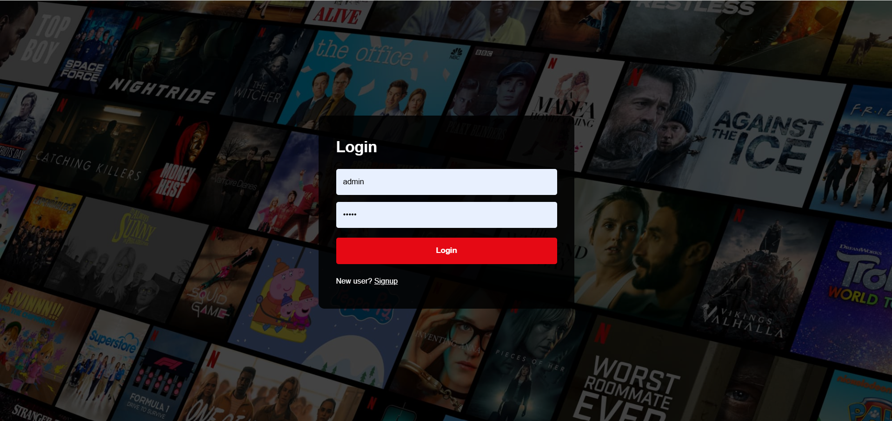
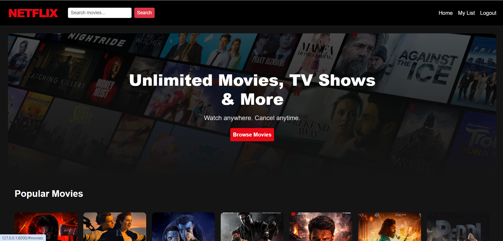

# Netflix Clone

A Netflix-inspired streaming platform built using Django.

## Features

- User Signup & Login
- Logout Functionality
- Movie Catalog
- Movie Search
- Watch Movies
- My List Feature
- Responsive UI
- Netflix-style Design

## Tech Stack

- Python
- Django
- SQLite
- HTML
- CSS
- Bootstrap
- JavaScript

## Installation

1. Clone the repository https://github.com/Sumanth-yadav18/Netflix-Clone-Django.git

```
git clone 
```

2. Install dependencies

```
pip install -r requirements.txt
```

3. Run migrations

```
python manage.py migrate
```

4. Start server

```
python manage.py runserver
```

5. Open browser

```
http://127.0.0.1:8000/
```

## Screenshots

### Home Page


### Login Page


### Signup Page


### Cards Page


## Author

G SUMANTH