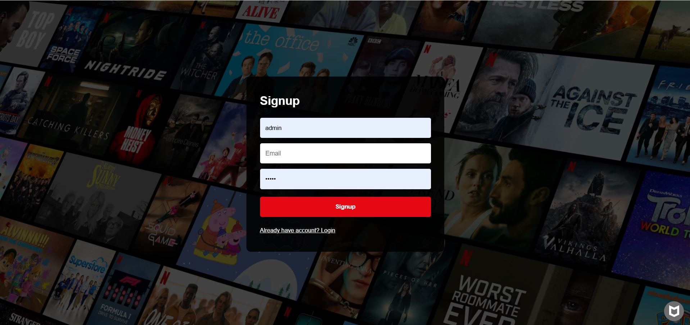

# 🎬 Netflix Clone

A Netflix-inspired movie streaming platform built using Django. Users can browse movies, search content, Genre-Based Filtering, stream videos, and manage their personal watchlist through a responsive Netflix-style interface.

## 🚀 Live Demo

https://netflix-clone-django-qq1n.onrender.com

---

## ✨ Features

- User Signup & Login
- Logout Functionality
- Movie Catalog
- Movie Search
- Movie Streaming
- My List (Watchlist) Feature
- Dynamic Movie Cards
- Movie Cover Banners
- Genre-Based Filtering
- Django Admin Panel
- AWS S3 Media Storage
- Responsive Netflix-style UI
- Render Deployment

---

## 🛠️ Tech Stack

### Backend
- Python
- Django

### Frontend
- HTML
- CSS
- Bootstrap
- JavaScript

### Database
- SQLite

### Cloud & Deployment
- AWS S3
- Render

---

## ⚙️ Installation

### Clone Repository

```
git clone https://github.com/Sumanth-yadav18/Netflix-Clone-Django.git
```

### Install Dependencies

```
pip install -r requirements.txt
```

### Run Migrations

```
python manage.py migrate
```

### Create Superuser

```
python manage.py createsuperuser
```

### Start Server

```
python manage.py runserver
```

### Open Browser

```
http://127.0.0.1:8000/
```

---

## ☁️ AWS S3 Integration

Movie videos, card images, and cover images are stored and served through AWS S3, providing scalable and reliable media storage.

---

## 📸 Screenshots

### Home Page


### Login Page


### Signup Page



### Movie Catalog


---

## 🔐 Admin Panel

The Django Admin Panel allows administrators to:

- Manage Movies
- Upload Videos
- Manage Users
- Update Movie Information
- Control Watchlist Data

Admin URL:

```
/admin/
```

---

---

## 👨‍💻 Author

### G Sumanth

Live Project:
https://netflix-clone-django-qq1n.onrender.com

---
